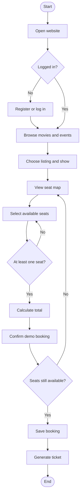

# Activity Diagram – booking flow

```mermaid
flowchart TD
    A([Start]) --> B[Open website]
    B --> C{Logged in?}
    C -- No --> D[Register or log in]
    D --> E[Browse movies and events]
    C -- Yes --> E
    E --> F[Choose listing and show]
    F --> G[View seat map]
    G --> H[Select available seats]
    H --> I{At least one seat?}
    I -- No --> H
    I -- Yes --> J[Calculate total]
    J --> K[Confirm demo booking]
    K --> L{Seats still available?}
    L -- No --> G
    L -- Yes --> M[Save booking]
    M --> N[Generate ticket]
    N --> O([End])
```
