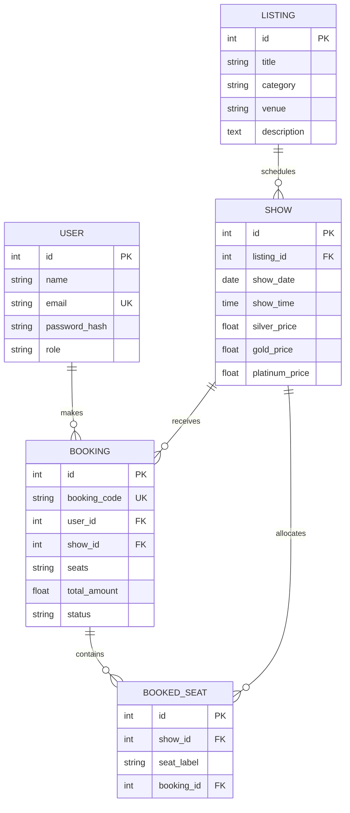

# Entity Relationship Diagram

```mermaid
erDiagram
    USER ||--o{ BOOKING : makes
    LISTING ||--o{ SHOW : schedules
    SHOW ||--o{ BOOKING : receives
    BOOKING ||--o{ BOOKED_SEAT : contains
    SHOW ||--o{ BOOKED_SEAT : allocates

    USER {
      int id PK
      string name
      string email UK
      string password_hash
      string role
    }
    LISTING {
      int id PK
      string title
      string category
      string venue
      text description
    }
    SHOW {
      int id PK
      int listing_id FK
      date show_date
      time show_time
      float silver_price
      float gold_price
      float platinum_price
    }
    BOOKING {
      int id PK
      string booking_code UK
      int user_id FK
      int show_id FK
      string seats
      float total_amount
      string status
    }
    BOOKED_SEAT {
      int id PK
      int show_id FK
      string seat_label
      int booking_id FK
    }
```
