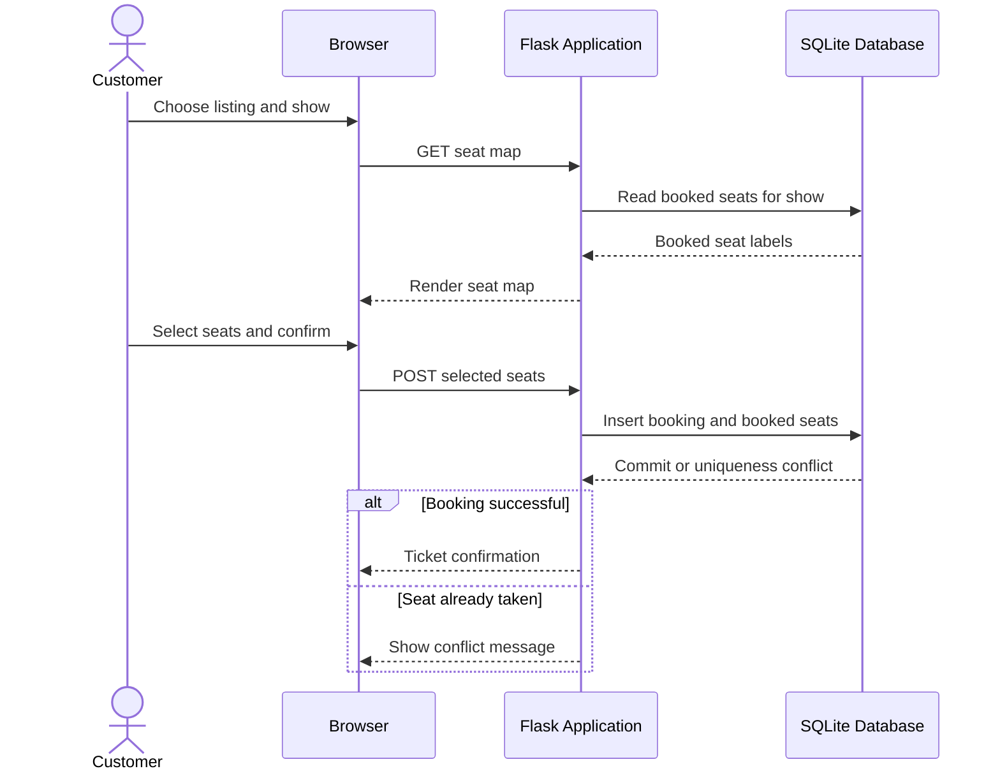

# Sequence Diagram – booking flow

```mermaid
sequenceDiagram
    actor Customer
    participant Browser
    participant Flask as Flask Application
    participant DB as SQLite Database
    Customer->>Browser: Choose listing and show
    Browser->>Flask: GET seat map
    Flask->>DB: Read booked seats for show
    DB-->>Flask: Booked seat labels
    Flask-->>Browser: Render seat map
    Customer->>Browser: Select seats and confirm
    Browser->>Flask: POST selected seats
    Flask->>DB: Insert booking and booked seats
    DB-->>Flask: Commit or uniqueness conflict
    alt Booking successful
        Flask-->>Browser: Ticket confirmation
    else Seat already taken
        Flask-->>Browser: Show conflict message
    end
```
